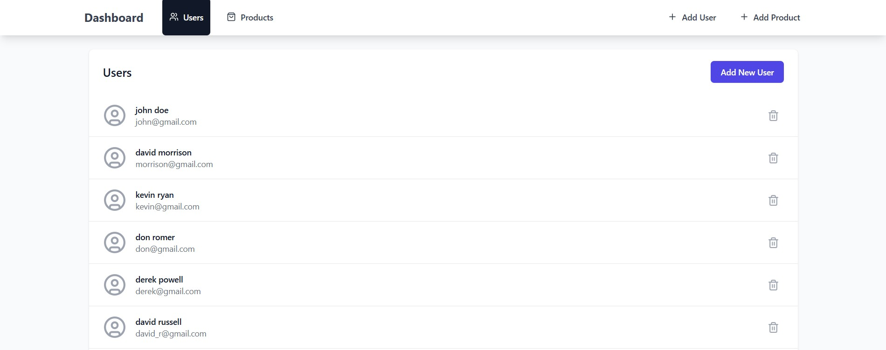
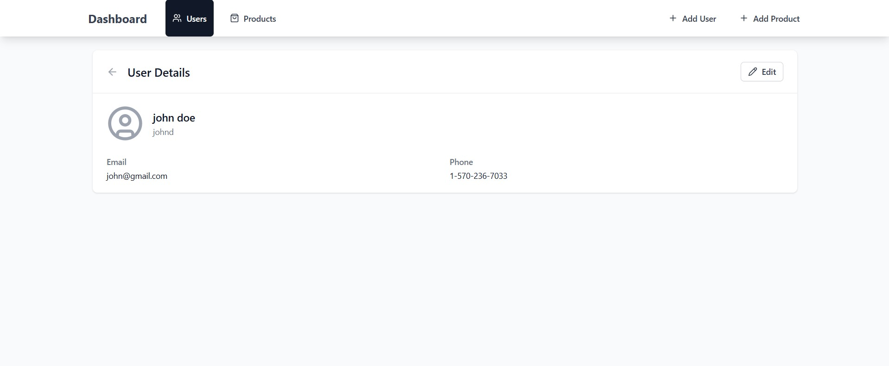
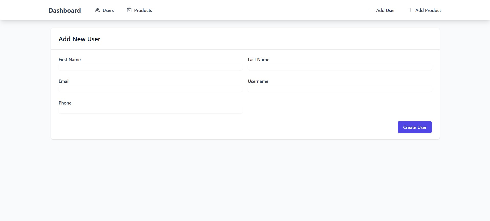
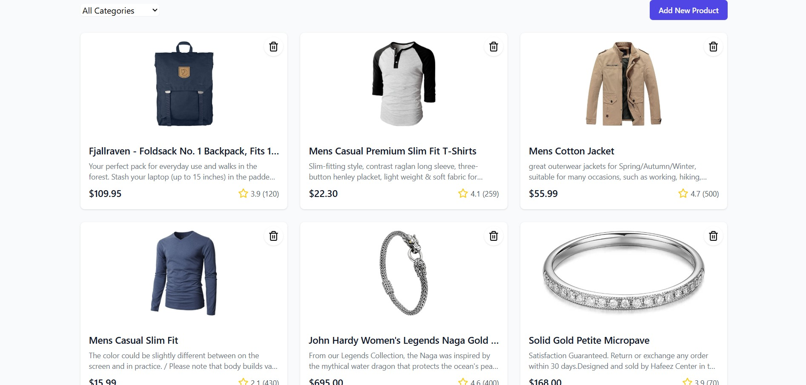
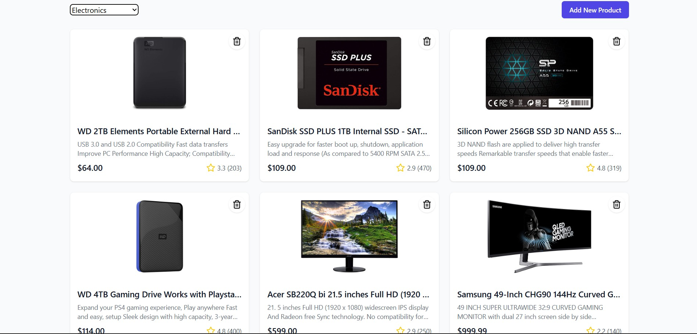
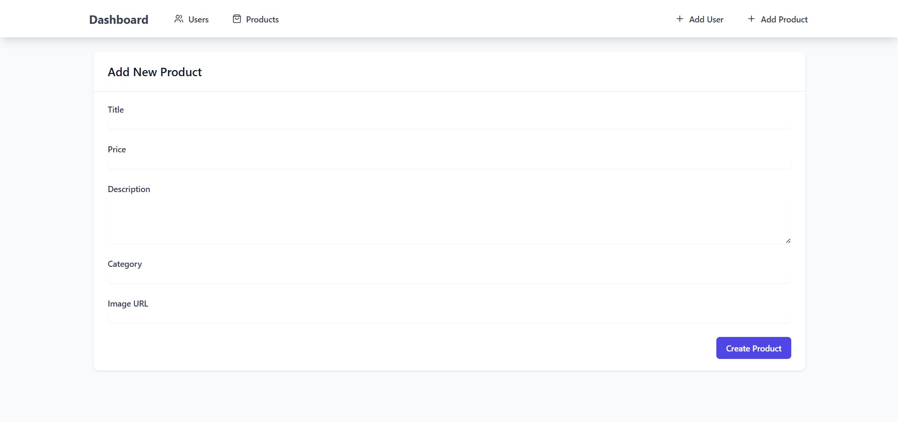

# 🛠️ React Admin Dashboard (Users & Products CRUD)
## 🚹 Users Section

  
  
  |

---

## 🛒 Products Section

  
  
  |


A responsive, user-friendly admin dashboard built with **React**, **React Router**, and **Tailwind CSS**, featuring CRUD operations for users and products using the **FakeStore API**. The app emphasizes intuitive UX, clean UI, smooth routing, and efficient state management.

---

## 🚀 Features

- **Users Management**  
  - View all users  
  - Add new users  
  - View individual user details  
  - Edit & update user  
  - Delete user  

- **Products Management**  
  - View all products  
  - Add new products  
  - View product details  
  - Edit & update product  
  - Delete product  

- **Core Features**
  - React Functional Components with Hooks (`useState`, `useEffect`, `useContext`)
  - Form handling with **React Hook Form** & validation with **Zod**
  - API integration via **Axios**
  - Clean, responsive UI styled using **Tailwind CSS**
  - Smooth routing with **React Router**
  - Lazy-loaded pages for performance optimization
  - Type safety via TypeScript
  - Loading states & error handling
  
---

## 🏗️ Tech Stack

| Technology           | Purpose                                |
|---------------------|----------------------------------------|
| React               | UI Development                         |
| React Router        | Routing & Navigation                   |
| Axios               | API Integration                        |
| React Hook Form     | Form Handling                          |
| Zod                 | Form Validation                        |
| Tailwind CSS        | Styling & Responsiveness               |
| TypeScript          | Type Safety                            |
| Context API (Optional) | State Management                   |

---

## 📂 Folder Structure

```
src/
├── components/
│   └── Navbar.tsx               // Navigation bar component
├── pages/
│   └── UsersList.tsx            // List all users
│   └── UserDetails.tsx          // User detail page
│   └── AddUser.tsx              // Add new user form
│   └── ProductsList.tsx         // List all products
│   └── ProductDetails.tsx       // Product detail page
│   └── AddProduct.tsx           // Add new product form
├── services/
│   └── api.ts                   // Axios instance & API functions
├── types/
│   └── User.ts                  // Type definitions for users
│   └── Product.ts               // Type definitions for products
├── App.tsx                      // Routes setup
└── main.tsx                     // App entry point
```

---

## 🔥 Installation & Setup

1. **Clone the repository:**

```bash
git clone https://github.com/CodeByTejas/dashboard-frontend.git
cd dashboard-frontend
```

2. **Install dependencies:**

```bash
npm install
# or
yarn install
```

3. **Run the development server:**

```bash
npm run dev
# or
yarn dev
```

4. **Build for production:**

```bash
npm run build
# or
yarn build
```

---

## 🌐 Available Routes

| Route              | Description                    |
|-------------------|--------------------------------|
| `/users`          | List of all users              |
| `/users/:id`      | User details                   |
| `/add-user`       | Form to add a new user         |
| `/products`       | List of all products           |
| `/products/:id`   | Product details                |
| `/add-product`    | Form to add a new product      |

---

## ✅ Best Practices Implemented

- **Separation of Concerns:** Clear split between API services, UI components, and pages.
- **Reusability:** Modular components for forms, cards, and UI elements.
- **Accessibility & UX Focus:** Responsive design, keyboard-friendly, and clean navigation.
- **Error Handling & Loading States:** Smooth user experience with clear feedback.
- **Lazy Loading:** For better performance on initial load.

---

## 🤝 Contribution

1. Fork the project.
2. Create your feature branch:
   ```
   git checkout -b feature/YourFeature
   ```
3. Commit your changes:
   ```
   git commit -m "Add: Your feature summary"
   ```
4. Push to the branch:
   ```
   git push origin feature/YourFeature
   ```
5. Open a Pull Request.

---

## 📄 License

This project is licensed under the **MIT License**.  
Feel free to use and customize it as needed!


## 💡 Future Improvements

- Add authentication & authorization
- Pagination & search filters
- Advanced product/user analytics dashboard
- Unit testing with Jest & React Testing Library


## 🔗 FakeStore API Reference

- API Docs: [https://fakestoreapi.com/docs](https://fakestoreapi.com/docs)
